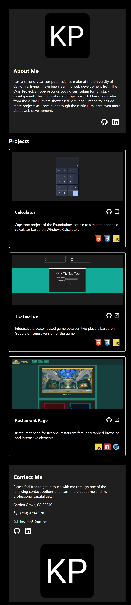
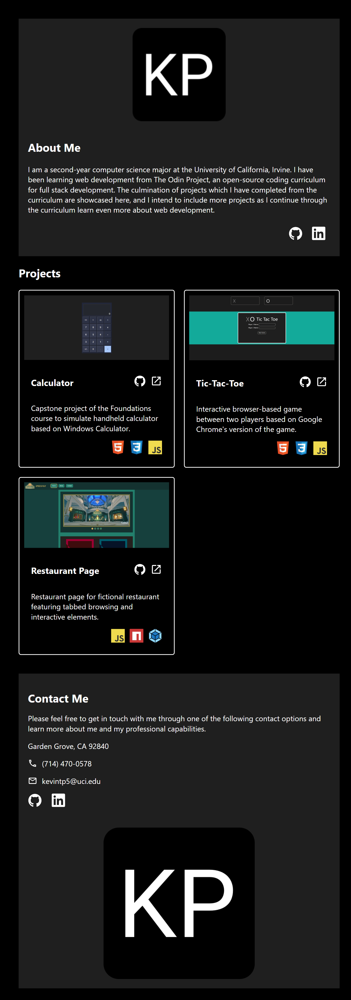
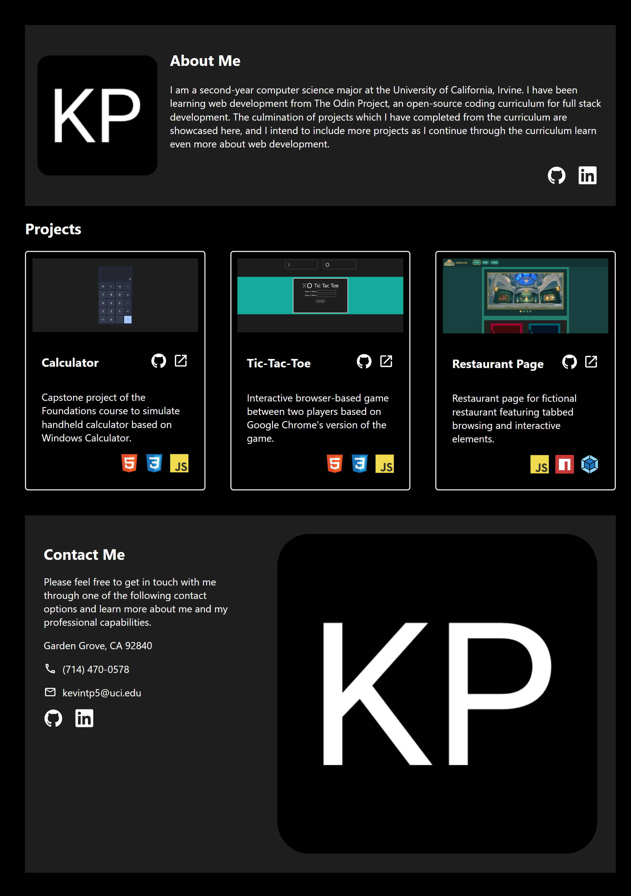

# homepage
*Icons representing programming languages, designing, and development tools were downloaded from [Devicon](https://devicon.dev/) and material icons were downloaded from [Material Design Icons](https://pictogrammers.com/library/mdi/).*  

The capstone project of the Advanced HTML and CSS course is the creation of a homepage with responsive design for a digital portfolio. The main learning objective of the capstone project is mobile-first design through the use of media queries for responsive websites based on the screen size of devices. Instead of using media queries to scale down to accomodate smaller screen sizes, mobile-first design prioritzes the constraints of smaller device widths and scales up to accomodate larger device widths.    

## Mobile

## Breakpoint for Tablets

## Breakpoint for Laptops and Desktops
